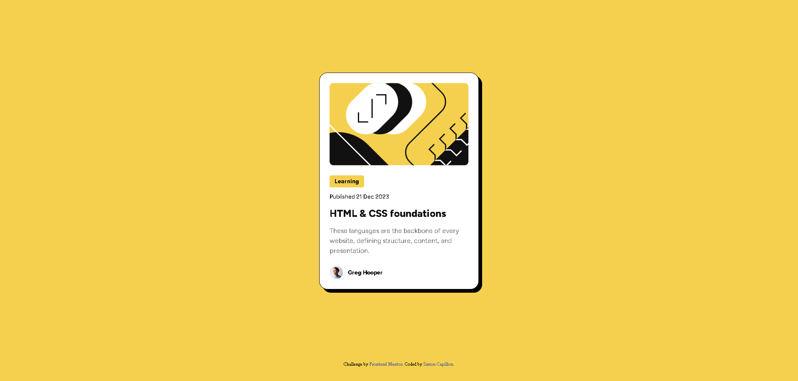

# Frontend Mentor - Blog preview card solution

This is a solution to the [Blog preview card challenge on Frontend Mentor](https://www.frontendmentor.io/challenges/blog-preview-card-ckPaj01IcS). Frontend Mentor challenges help you improve your coding skills by building realistic projects. 

## Table of contents

- [Overview](#overview)
  - [The challenge](#the-challenge)
  - [Screenshot](#screenshot)
  - [Links](#links)
- [My process](#my-process)
  - [Built with](#built-with)
  - [Continued development](#continued-development)
  - [Useful resources](#useful-resources)
- [Author](#author)

## Overview

### The challenge

Users should be able to:

- See hover and focus states for all interactive elements on the page

### Screenshot

**Note: Delete this note and the paragraphs above when you add your screenshot. If you prefer not to add a screenshot, feel free to remove this entire section.**

### Links

- Live Site URL: https://blog-preview-card-frontend-mentor-snowy.vercel.app/

## My process

### Built with

- Semantic HTML5 markup
- CSS custom properties
- Flexbox
- CSS Grid
- Responsive workflow

### Continued development

I want to continue focusing and learning on the new features of CSS (2023) in future projects and then try Tailwind CSS.

### Useful resources

- [Box Shadow Generator](https://html-css-js.com/css/generator/box-shadow/) - This helped me to easily create the bow shadow of the card.
- [CSS custom properties (variables)](https://developer.mozilla.org/en-US/docs/Web/CSS/Using_CSS_custom_properties) - I really love this CSS feature, it didn't exist when I learned css. Useful !
- [CSS Reset](https://meyerweb.com/eric/tools/css/reset/) - For a better CSS start.
- [Using CSS Nesting](https://developer.mozilla.org/en-US/docs/Web/CSS/CSS_nesting/Using_CSS_nesting) - New feature I didn't know about, very useful too.
- [Pixels to Rem converter](https://nekocalc.com/fr/px-a-rem-convertisseur) - To convert easily

## Author

- Website - [Simon Capillon](https://simoncapillon.com/)
- Frontend Mentor - [@simon7195](https://www.frontendmentor.io/profile/simon7195)
